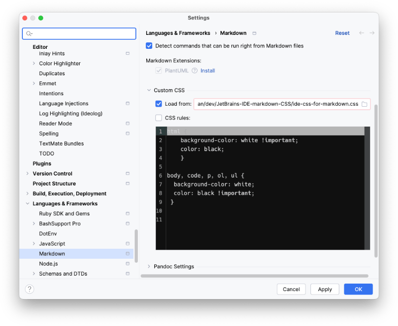

# JetBrains-IDE-markdown-CSS

A CSS file for JetBrains IDEs

## Why

I prefer to have the `README`s (and probably other files that use Markdown) displayed with a
light background and dark text — contrary to the code which i prefer light on dark.
Yes. I may be a bit inconsistent in this respect. 😃

## How to use

* Clone the repository
* Copy the location of `./ide-css-for-markdown.css`
* Open the settings in IntelliJ/RubyMine/…
  
